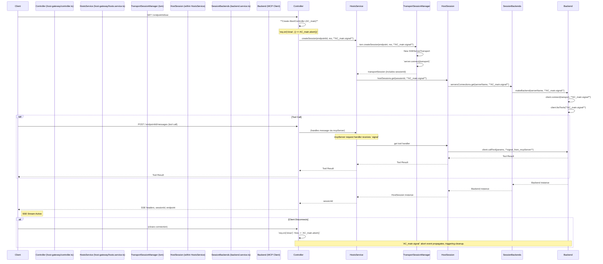

# AbortSignal Integration Strategy for SSE Server

## 1. Overview

This document outlines the strategy for integrating `AbortSignal` into the SSE server to manage request lifecycles, cancellations, and resource cleanup effectively. The goal is to provide a robust mechanism for handling client disconnects, timeouts, and server-initiated cancellations.

## 2. Current SSE Flow Lifecycle & `AbortSignal` Integration Points

The current SSE flow involves several key components. The following diagram illustrates the lifecycle with proposed `AbortSignal` integration:

**Key Integration Points:**
- An `AbortController` (`AC_main`) is created in `host-gateway/controller.ts` for each SSE request.
- `AC_main.abort()` is called when `req.on("close")` fires.
- The `AC_main.signal` is propagated through `HostsService`, `TransportSessionManager`, `HostSession`, `SessionBackends`, and finally to `Backend` service instances.
- SDK calls (`client.connect`, `client.listTools`, `client.callTool`) and `fetch` operations will use this signal.
- The `makeServicesContainer` in `etc/service.ts` will be modified to manage and react to these signals for service lifecycle and cleanup.

## 3. `AbortSignal` Integration Strategy

### A. `AbortController` Instantiation Points
1.  **Primary Controller (`AC_main`)**: In `host-gateway/controller.ts` for each SSE request.
2.  **Service Container Controllers**: Implicitly managed by the modified `makeServicesContainer` to link service lifecycle to signals.
3.  **Timeout Controllers**: Using `AbortSignal.timeout()` or dedicated controllers for specific timeouts (e.g., connection attempts).

### B. Signal Propagation Paths
1.  **Modify `makeServicesContainer` (`etc/service.ts`)**:
    - Update `factory` and `get` methods to accept `ServiceOptions = { signal?: AbortSignal }`.
    - Implement logic from reference material to manage signal propagation to the factory, listen for `abort` events to close services, and handle `service.close()` calls to abort internal controllers.
2.  **Controller to `HostsService`**: Pass `AC_main.signal` to `hostsServices.get()` and `HostsService.createSession()`.
3.  **`HostsService` to `TransportSessionManager`**: `HostsService.initSession` passes the signal to `tsm.createSession()`.
4.  **`HostsService` to `HostSession`**: `HostsService.initSession` passes the signal to `hostSessions.get()`.
5.  **`HostSession` to `Backend` Services**: `makeHostSession` passes the signal to `serversConnections.get()`.
6.  **Within `Backend` Service (`backend.service.ts`)**:
    - Pass signal to `client.connect()`, `client.listTools()`.
    - Use signal for connection timeouts and retry delays.
    - Pass signal to `fetch` in `createSseTransport`.
7.  **MCP SDK Client**: Adapt to SDK's `AbortSignal` support or wrap calls if unsupported.

### C. How `AbortSignal` Will Trigger Cleanup
1.  **`req.on("close")` in Controller**: Calls `AC_main.abort()`.
2.  **`makeServicesContainer`**: Listens to `abort` event on the signal, calls `service.close()`.
3.  **`TransportSessionManager`**: `TransportSession.close()` (triggered via service closure) handles its specific cleanup.
4.  **`Backend` Service**: Its `close()` method (triggered via service closure) calls `client.close()`. `StdioClientTransport`'s `close` must terminate child processes.
5.  **Timers/Intervals**: Explicitly cleared via `addEventListener('abort')`.

## 4. Cleanup Hierarchy Refinement

### A. `AbortSignal` as Primary Driver
The `AC_main.signal` will be the main trigger for cleanup across all layers for an SSE connection.

### B. Controlling/Replacing Existing Cleanup Mechanisms
- `req.on("close")` in controller will primarily call `AC_main.abort()`. Service cleanup will follow via `makeServicesContainer`.
- `TransportSessionManager.cleanupInactiveSessions()` remains a fallback.
- Error-driven cleanup in TSM (`transport.onerror`, `transport.onclose`) complements signal-based cleanup.

### C. Impacts on Current Resource Management
- `StdioClientTransport`: `close()` must terminate child process, triggered by signal.
- `SSEClientTransport`: `close()` called; `fetch` calls aborted by signal.
- Service Instances: Removed from cache and closed by `makeServicesContainer` on signal abort.
- Timers: Cancelled by signal listeners.

### D. Comprehensive Coverage of Cleanup Scenarios
1.  **Client Disconnect**: Handled by `AC_main.abort()`.
2.  **Server-Initiated Shutdown**: Server iterates active `AbortController`s and aborts them.
3.  **Errors During Setup**: `makeServicesContainer` handles promise rejections and aborts internal controllers. Signal used with `Promise.race` for setup timeouts.
4.  **Internal Timeouts**: Managed by `AbortSignal.timeout()` or aborting controllers.
5.  **Explicit `service.close()` calls**: `makeServicesContainer` aborts associated internal controller.

## 5. Test Cases

### A. Stream Termination Validation
1.  Client-side disconnect correctly terminates the server-side stream.
2.  Server-side (simulated) abort terminates the stream.
3.  Connection timeout during backend connect aborts the attempt.
4.  Operation timeout (e.g., `listTools`) cancels the operation.

### B. Resource Deallocation Verification
1.  **On Client Disconnect**: Verify `TransportSession`, `HostSession`, `Backend` services are closed/removed, child processes (stdio) terminated, and timers cleared.
2.  **On Inactivity Cleanup**: Verify all associated resources are deallocated.
3.  **On Graceful Server Shutdown**: Verify all active connections and resources are cleaned up.

### C. Error Handling Scenarios
1.  Abort during in-flight `client.callTool` cancels the call and cleans resources.
2.  Abort during `client.listTools` cancels the operation.
3.  Abort during initial `client.connect` cancels the attempt.
4.  `checkSignal()` in `HostsService` throws `McpError` if signal is already aborted.
5.  Error within a `service.close()` method (triggered by signal) is logged, but overall abort/cleanup continues.
6.  Wrappers for SDK methods without `AbortSignal` support correctly handle abort events.