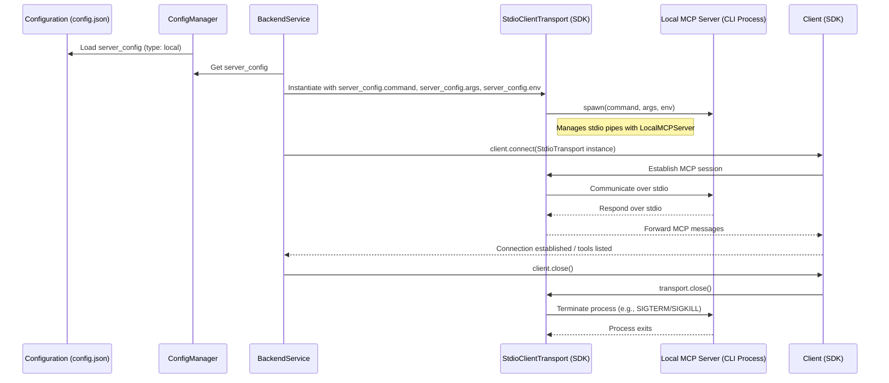

# High-Level Implementation Plan: Local CLI Server Management via Stdio

**1. Introduction**

This plan outlines the architecture and steps to integrate robust support for managing local, MCP-compliant CLI-based server processes using `StdioClientTransport` from the `@modelcontextprotocol/sdk`. The goal is to allow the system to reliably start, monitor, and stop these external CLI applications. Remote server management will not be affected by these changes.

**2. Guiding Principles**

*   **Leverage SDK:** Utilize `StdioClientTransport` for managing the lifecycle and communication with local MCP servers.
*   **Minimal Schema Changes:** Adapt existing configuration schema with minimal modifications, as current fields are largely compatible.
*   **Clear Integration:** Modify existing services (`BackendService`) to incorporate the new transport mechanism.
*   **Robustness:** Ensure proper error handling, process cleanup, and lifecycle management.

**3. Architecture & Key Components**

*   **Configuration ([`src/etc/config-schema.ts`](src/etc/config-schema.ts:1), [`src/config-manager.ts`](src/config-manager.ts:1)):**
    *   The existing `LocalServer` interface in [`src/etc/config-schema.ts`](src/etc/config-schema.ts:2) (`command`, `args`, `env`, `description`) is suitable.
    *   `StdioClientTransport` primarily requires `command` and `args`. The `env` field will be used to set environment variables for the spawned process.
*   **Backend Service ([`src/backend.service.ts`](src/backend.service.ts:1)):**
    *   This service will be the core integration point.
    *   `setupLocalServer` function will be refactored to use `StdioClientTransport`.
    *   The `localServerProcesses: Map<string, ChildProcess>` might no longer be needed for stdio servers if `StdioClientTransport` fully manages the child process lifecycle, including termination. This needs to be confirmed during implementation.
*   **MCP SDK (`@modelcontextprotocol/sdk`):**
    *   `StdioClientTransport`: The primary component for spawning the local CLI server and establishing communication over stdin/stdout.
    *   `Client`: Used to connect to the server via the `StdioClientTransport`.

**Diagram: Local Server Connection Flow (Stdio)**



**4. Detailed Steps**

**Step 4.1: Configuration Schema Review (No changes anticipated)**

*   **Action:** Confirm that the existing `LocalServer` interface in [`src/etc/config-schema.ts`](src/etc/config-schema.ts:2) (`command`, `args`, `env`, `description`) is sufficient for `StdioClientTransport`.
*   **Details:**
    *   `command`: string (e.g., "node", "python")
    *   `args`: string[] (e.g., ["../fixtures/my-mcp-server.js"])
    *   `env?`: Record<string, string> (e.g., `{ "NODE_ENV": "development" }`)
*   **Outcome:** Validated schema.

**Step 4.2: Refactor `setupLocalServer` in `src/backend.service.ts`**

*   **Action:** Modify [`setupLocalServer`](src/backend.service.ts:126) to instantiate and return an `StdioClientTransport`.
*   **Details:**
    *   Remove the existing `spawn` logic (lines 150-173) and the placeholder HTTP/SSE transport creation (lines 135-147, 175-184).
    *   The function signature will likely change to:
        ```typescript
        async function setupLocalStdioTransport(
          serverName: string,
          config: LocalServer // from config-schema.ts
        ): Promise<StdioClientTransport>
        ```
    *   Inside the function:
        ```typescript
        logger.info(
          `Setting up local stdio server "${serverName}" with command: ${config.command} ${config.args.join(" ")}`
        );

        const transport = new StdioClientTransport({
          command: config.command,
          args: config.args,
          env: { ...process.env, ...config.env }, // Ensure env is passed
        });
        
        // StdioClientTransport handles process spawning internally.
        // Logging of stdout/stderr for MCP debugging is typically handled by the SDK.
        // If general purpose logging of the CLI's output is needed beyond MCP,
        // investigate if the SDK transport offers hooks or if this is out of scope.

        return transport;
        ```
    *   Remove the `localServerProcesses: Map<string, ChildProcess>` parameter and its usage within this function for stdio servers. The transport should manage the process.
*   **Outcome:** `setupLocalServer` (renamed for clarity, e.g., `setupLocalStdioTransport`) correctly creates and returns an `StdioClientTransport`.

**Step 4.3: Update `makeBackend` in `src/backend.service.ts`**

*   **Action:** Modify [`makeBackend`](src/backend.service.ts:20) to use the new stdio transport setup for local servers.
*   **Details:**
    *   When `isLocalServer(serverConfig)` is true:
        *   Call the refactored `setupLocalStdioTransport` instead of the old `setupLocalServer`.
        *   The `transport` variable will now hold an `StdioClientTransport` instance.
        *   The subsequent `await client.connect(transport)` will work with this stdio transport.
    *   **Process Cleanup:** Review the `close` handler within `makeBackend` (lines 75-107).
        *   The manual `serverProcess.kill()` (lines 91-104) should be removed or conditionally skipped for stdio-based local servers if `StdioClientTransport.close()` (triggered by `client.close()`) handles the termination of the child process. This is the expected behavior from the SDK.
        *   If `localServerProcesses` map is removed or no longer tracks stdio servers, this section will simplify.
*   **Outcome:** `makeBackend` correctly uses `StdioClientTransport` for local servers and relies on it for process lifecycle.

**Step 4.4: Process Lifecycle Management**

*   **Spawning:** Handled by `new StdioClientTransport(...)`.
*   **PID Tracking:** Assumed to be managed internally by `StdioClientTransport`. If external PID tracking is essential for other system parts, this needs further investigation into SDK capabilities.
*   **Graceful Shutdown:**
    *   `client.close()` will trigger the `StdioClientTransport` to close the connection and terminate the child process.
    *   The transport should ideally send `SIGTERM`, then `SIGKILL` after a timeout if the process doesn't exit. This is standard SDK behavior to verify.
*   **Error Handling:**
    *   Errors during transport instantiation (e.g., command not found) or connection should be caught by the existing `try...catch` block in `makeBackend`.
    *   Errors from the CLI process itself (e.g., crashes after starting but before MCP handshake, or during operation) should be handled by the `StdioClientTransport` and propagated appropriately, ideally leading to the `client.connect()` or subsequent operations failing.
*   **Stream Management (stdout/stderr):**
    *   `StdioClientTransport` uses these for MCP communication.
    *   The SDK's internal logging or debug options should be used if detailed insight into the stdio traffic is needed for debugging MCP interactions. General-purpose logging of all stdout/stderr from the CLI (if not part of MCP) is likely out of scope for the transport itself but could be configured if the `StdioClientTransport` allows passing custom spawn options for stdio redirection. For now, assume SDK handles necessary logging for its operation.

**5. Integration Points (Summary)**

*   [`src/etc/config-schema.ts`](src/etc/config-schema.ts:1): Defines `LocalServer` (no changes expected).
*   [`src/config-manager.ts`](src/config-manager.ts:1): Loads and validates configuration (no changes expected).
*   [`src/backend.service.ts`](src/backend.service.ts:1):
    *   Refactor `setupLocalServer` to `setupLocalStdioTransport`.
    *   Update `makeBackend` to use the new transport and adjust cleanup logic.

**6. Potential Challenges and Mitigation Strategies**

*   **Environment Variable Propagation:**
    *   **Challenge:** Ensuring `StdioClientTransport` correctly passes the `env` from `LocalServer` config to the spawned process.
    *   **Mitigation:** The example `new StdioClientTransport({ ..., env: { ...process.env, ...config.env }})` should handle this. Verify during implementation.
*   **Process Termination Reliability:**
    *   **Challenge:** Ensuring `StdioClientTransport` reliably terminates the child process on `client.close()` across different OS and scenarios (e.g., stubborn processes).
    *   **Mitigation:** Rely on and thoroughly test the SDK's implementation. If issues are found, report them to the SDK maintainers. Avoid manual process killing if the transport is meant to handle it.
*   **Error Propagation from Child Process:**
    *   **Challenge:** Non-MCP errors or early crashes in the child process before the MCP handshake might not be clearly reported.
    *   **Mitigation:** Test various failure modes of the local CLI server. `StdioClientTransport` should ideally reject its connection promise or emit an error event if the process exits prematurely or fails to start.
*   **Resource Leaks (Orphaned Processes):**
    *   **Challenge:** If the main application crashes, child processes managed by `StdioClientTransport` might be orphaned.
    *   **Mitigation:** This is a general OS-level concern. The application's existing signal handling in [`src/index.ts`](src/index.ts:21) (SIGINT, SIGTERM) which calls `server.close()` (and subsequently `client.close()` for all backends) is the primary mechanism. Ensure this cleanup path is robust.

**7. High-Level Testing Approach**

*   **Unit Tests:**
    *   Test the refactored `setupLocalStdioTransport` to ensure it correctly instantiates `StdioClientTransport` with the correct parameters (command, args, env). Mock `StdioClientTransport` constructor.
    *   Test `makeBackend`: Mock `setupLocalStdioTransport` and `Client`, verify `client.connect` is called with the stdio transport. Verify cleanup logic changes.
*   **Integration Tests:**
    *   Develop a simple, reference MCP-compliant CLI server that communicates via stdio (e.g., a Node.js script using `@modelcontextprotocol/sdk/server`). This could be similar to [`test/fixtures/mock-mcp-backend.cjs`](test/fixtures/mock-mcp-backend.cjs:1) but adapted for stdio.
    *   Configure this server as a `LocalServer` in a test configuration file.
    *   **Scenario 1 (Happy Path):**
        *   System starts the local CLI server.
        *   `Client` connects successfully via `StdioClientTransport`.
        *   Perform basic MCP operations (e.g., `listTools`).
        *   `Client` closes, and the local CLI server process terminates cleanly.
    *   **Scenario 2 (CLI Server Fails to Start):**
        *   Configure an invalid command.
        *   Verify that `client.connect()` fails with an appropriate error.
    *   **Scenario 3 (CLI Server Crashes):**
        *   Modify the test CLI server to crash after starting or during an operation.
        *   Verify that the `Client` connection is lost or an error is reported.
    *   **Scenario 4 (Environment Variables):**
        *   Configure `env` for the local server.
        *   Modify the test CLI server to print an environment variable to its stderr (for testing, not MCP). Verify the variable is set. (This might require temporary access to the raw stderr if the SDK doesn't expose it, or the CLI tool could write it to a file for assertion).
*   **Manual Testing:**
    *   Observe process lists to ensure processes are spawned and terminated correctly.
    *   Review logs for correct information and error reporting.